# Лабораторна робота №4

**Тема:** Аналітичні SQL-запити (OLAP)  
**Виконав:** Вовк Андрій, Троценко Максим, група ІО-41

## Мета роботи
Використати створену в попередніх лабораторних роботах базу даних інтернет-магазину гітар для написання аналітичних SQL-запитів у PostgreSQL. Під час виконання роботи потрібно застосувати агрегатні функції, групування, фільтрацію агрегованих результатів, різні типи з'єднань таблиць і підзапити.

## Вихідні дані
Основою для виконання роботи є схема бази даних, створена в лабораторних роботах 1-3. База даних містить таблиці `Customer`, `Category`, `Product`, `CustomerOrder`, `OrderItem`, `Rent`, `StudioBooking`, `InstrumentBuyIn`, `RepairService`, `SetUpService`.

## SQL-запити

### 1. Загальна кількість клієнтів
Запит обчислює загальну кількість зареєстрованих клієнтів у таблиці `Customer` за допомогою функції `COUNT`.

```sql
SELECT COUNT(*) AS total_customers
FROM Customer;
```

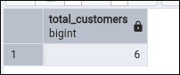

### 2. Статистика цін на товари
Запит визначає середню, мінімальну та максимальну ціну товарів із таблиці `Product` за допомогою функцій `AVG`, `MIN` і `MAX`.

```sql
SELECT
    AVG(Price) AS avg_product_price,
    MIN(Price) AS min_product_price,
    MAX(Price) AS max_product_price
FROM Product;
```

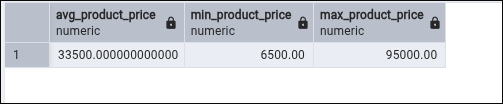

### 3. Загальна вартість товарних залишків
Запит обчислює сумарну вартість товарів на складі як добуток ціни товару на його кількість у таблиці `Product`.

```sql
SELECT SUM(Price * StockQuantity) AS total_inventory_value
FROM Product;
```

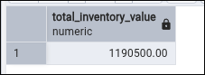

### 4. Кількість товарів у кожній категорії
Запит групує товари за категоріями та підраховує кількість товарів у кожній категорії. Використано `LEFT JOIN`, щоб за потреби показати навіть категорії без товарів.

```sql
SELECT
    c.Name AS category_name,
    COUNT(p.ProductID) AS product_count
FROM Category c
LEFT JOIN Product p ON p.CategoryID = c.CategoryID
GROUP BY c.CategoryID, c.Name
ORDER BY product_count DESC, c.Name;
```

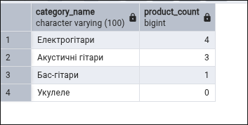

### 5. Категорії, у яких більше одного товару
Запит використовує `GROUP BY` і `HAVING` для відбору лише тих категорій, у яких кількість товарів більша за один.

```sql
SELECT
    c.Name AS category_name,
    COUNT(p.ProductID) AS product_count
FROM Category c
JOIN Product p ON p.CategoryID = c.CategoryID
GROUP BY c.CategoryID, c.Name
HAVING COUNT(p.ProductID) > 1
ORDER BY product_count DESC, c.Name;
```

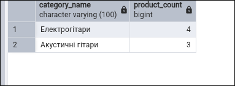

### 6. Список замовлень із клієнтами
Запит за допомогою `INNER JOIN` об'єднує таблиці `CustomerOrder` і `Customer`, щоб показати номер замовлення, клієнта, дату, статус і суму.

```sql
SELECT
    co.OrderID,
    c.FirstName,
    c.LastName,
    co.OrderDate,
    co.Status,
    co.TotalAmount
FROM CustomerOrder co
INNER JOIN Customer c ON c.CustomerID = co.CustomerID
ORDER BY co.OrderDate;
```

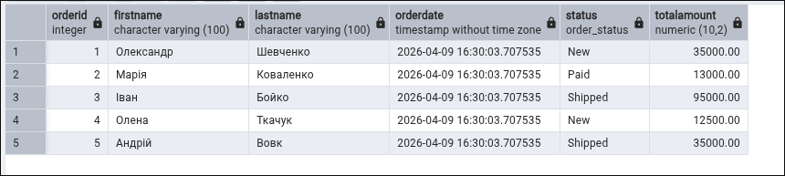

### 7. Усі категорії та середня ціна товарів у них
Запит з `LEFT JOIN` показує кожну категорію, кількість товарів у ній та середню ціну товарів.

```sql
SELECT
    c.Name AS category_name,
    COUNT(p.ProductID) AS product_count,
    AVG(p.Price) AS avg_category_price
FROM Category c
LEFT JOIN Product p ON p.CategoryID = c.CategoryID
GROUP BY c.CategoryID, c.Name
ORDER BY c.Name;
```

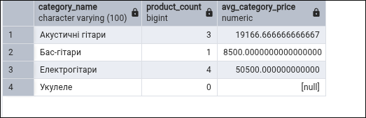

### 8. Товари та їх категорії
Запит із `RIGHT JOIN` показує категорію, бренд, модель і ціну товару. Цей запит демонструє ще один тип з'єднання таблиць.

```sql
SELECT
    c.Name AS category_name,
    p.Brand,
    p.Model,
    p.Price
FROM Product p
RIGHT JOIN Category c ON p.CategoryID = c.CategoryID
ORDER BY c.Name, p.Brand, p.Model;
```

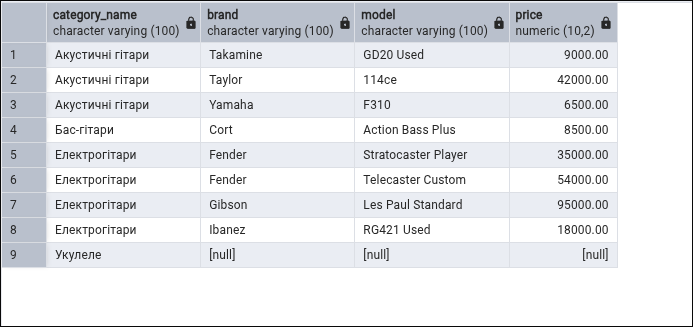

### 9. Скільки витратив кожен клієнт
Запит виконує багатотабличну агрегацію через `Customer`, `CustomerOrder` і `OrderItem`. У результаті визначається загальна сума витрат кожного клієнта.

```sql
SELECT
    c.CustomerID,
    c.FirstName,
    c.LastName,
    SUM(oi.Quantity * oi.UnitPrice) AS total_spent
FROM Customer c
JOIN CustomerOrder co ON co.CustomerID = c.CustomerID
JOIN OrderItem oi ON oi.OrderID = co.OrderID
GROUP BY c.CustomerID, c.FirstName, c.LastName
ORDER BY total_spent DESC;
```

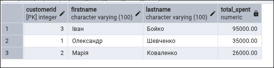

### 10. Товари дорожчі за середню ціну
Запит містить підзапит у `WHERE` і показує лише ті товари, ціна яких вища за середню ціну всіх товарів.

```sql
SELECT
    Brand,
    Model,
    Price
FROM Product
WHERE Price > (
    SELECT AVG(Price)
    FROM Product
)
ORDER BY Price DESC;
```

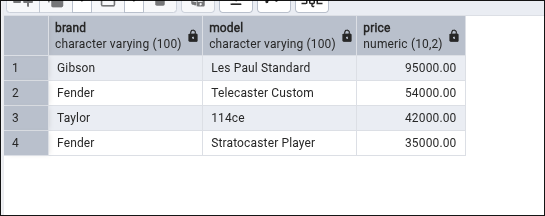

### 11. Кількість замовлень кожного клієнта
Запит використовує корельований підзапит у `SELECT` для підрахунку кількості замовлень, які належать кожному клієнту.

```sql
SELECT
    c.CustomerID,
    c.FirstName,
    c.LastName,
    (
        SELECT COUNT(*)
        FROM CustomerOrder co
        WHERE co.CustomerID = c.CustomerID
    ) AS order_count
FROM Customer c
ORDER BY order_count DESC, c.LastName, c.FirstName;
```

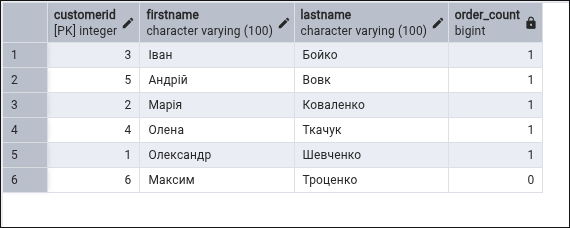

### 12. Клієнти, які витратили більше за середній рівень
Запит використовує підзапит у `HAVING`. Спочатку для кожного клієнта обчислюється сума витрат, а потім вибираються лише ті клієнти, чия сума більша за середнє значення серед усіх клієнтів, які мають замовлення.

```sql
SELECT
    c.CustomerID,
    c.FirstName,
    c.LastName,
    SUM(oi.Quantity * oi.UnitPrice) AS total_spent
FROM Customer c
JOIN CustomerOrder co ON co.CustomerID = c.CustomerID
JOIN OrderItem oi ON oi.OrderID = co.OrderID
GROUP BY c.CustomerID, c.FirstName, c.LastName
HAVING SUM(oi.Quantity * oi.UnitPrice) > (
    SELECT AVG(customer_total)
    FROM (
        SELECT SUM(oi2.Quantity * oi2.UnitPrice) AS customer_total
        FROM CustomerOrder co2
        JOIN OrderItem oi2 ON oi2.OrderID = co2.OrderID
        GROUP BY co2.CustomerID
    ) AS avg_totals
)
ORDER BY total_spent DESC;
```

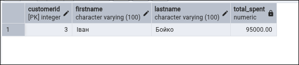

## Висновок
У ході виконання лабораторної роботи було створено набір аналітичних SQL-запитів для бази даних інтернет-магазину гітар. Було використано агрегатні функції `COUNT`, `SUM`, `AVG`, `MIN`, `MAX`, оператори `GROUP BY` і `HAVING`, різні типи `JOIN`, а також підзапити в `WHERE`, `SELECT` і `HAVING`. Отримані запити демонструють можливість виконання аналітичної обробки даних та побудови звітів на основі створеної раніше бази даних.
