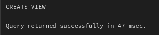
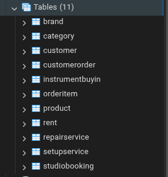

# Лабораторна робота №5

**Тема:** Нормалізація бази даних  
**Виконав:** Вовк Андрій, Троценко Максим, група ІО-41

## Мета роботи

Проаналізувати схему бази даних інтернет-магазину гітар, створену в лабораторній роботі №2, визначити функціональні залежності, перевірити відповідність таблиць нормальним формам та усунути надлишковість даних шляхом нормалізації до третьої нормальної форми.

## Вихідна схема бази даних

У лабораторній роботі №2 було створено схему предметної області «Інтернет-магазин гітар». Вона містить такі таблиці:

- `Customer` — клієнти магазину;
- `Category` — категорії товарів;
- `Product` — товари магазину;
- `CustomerOrder` — замовлення клієнтів;
- `OrderItem` — позиції замовлень;
- `Rent` — оренда інструментів;
- `StudioBooking` — записи до студії самозапису;
- `InstrumentBuyIn` — операції викупу вживаних інструментів;
- `RepairService` — послуги ремонту;
- `SetUpService` — послуги налаштування інструментів.

Більшість таблиць уже має коректні первинні та зовнішні ключі. Однак у схемі є атрибути, які дублюють або обчислюють дані, що вже можуть бути отримані з інших таблиць. Такі атрибути створюють ризик аномалій оновлення.

## Функціональні залежності початкової схеми

### `Customer`

Первинний ключ: `CustomerID`.

Функціональні залежності:

```text
CustomerID -> FirstName, LastName, Email, Phone, PasswordHash
Email -> CustomerID, FirstName, LastName, Phone, PasswordHash
```

Атрибут `Email` є унікальним, тому він також може бути альтернативним ключем.

### `Category`

Первинний ключ: `CategoryID`.

Функціональні залежності:

```text
CategoryID -> Name, Description
Name -> CategoryID, Description
```

Це семантична залежність предметної області: назва категорії має бути унікальною. Тому для фінальної схеми доцільно додати обмеження `UNIQUE` для `Name`.

### `Product`

Первинний ключ: `ProductID`.

Функціональні залежності:

```text
ProductID -> CategoryID, Brand, Model, Price, StockQuantity
CategoryID -> Category.Name, Category.Description
```

Проблема таблиці полягає в тому, що назва бренду зберігається текстом у кожному товарі. Якщо бренд повторюється в багатьох товарах, його назва дублюється. Це не порушує 1НФ, але створює аномалії оновлення. Наприклад, якщо назву бренду потрібно виправити, її доведеться змінювати в багатьох рядках `Product`.

### `CustomerOrder`

Первинний ключ: `OrderID`.

Функціональні залежності:

```text
OrderID -> CustomerID, OrderDate, Status, ShippingAddress, TotalAmount
```

Атрибут `TotalAmount` є похідним. Його можна обчислити як суму:

```text
SUM(OrderItem.Quantity * OrderItem.UnitPrice)
```

Отже, сума замовлення дублює інформацію з таблиці `OrderItem`. Якщо змінити кількість товару або ціну одиниці в `OrderItem`, але не оновити `CustomerOrder.TotalAmount`, виникне суперечність.

### `OrderItem`

Первинний ключ: `OrderItemID`.

Альтернативний ключ: `(OrderID, ProductID)`.

Функціональні залежності:

```text
OrderItemID -> OrderID, ProductID, Quantity, UnitPrice
OrderID, ProductID -> Quantity, UnitPrice
```

Таблиця реалізує зв'язок багато-до-багатьох між `CustomerOrder` і `Product`. Атрибути `Quantity` та `UnitPrice` залежать від повної пари `(OrderID, ProductID)`.

### `Rent`

Первинний ключ: `RentID`.

Функціональні залежності:

```text
RentID -> CustomerID, ProductID, PickUpDate, Duration, ReturnDate, Status,
          PercentageFromPrice, TotalRentPrice, DepositAmount
ProductID -> Product.Price
```

Атрибут `TotalRentPrice` є похідним, оскільки розраховується на основі ціни товару, відсотка оренди та тривалості. Якщо змінити `PercentageFromPrice`, `Duration` або ціну товару, збережене значення `TotalRentPrice` може стати некоректним.

### `StudioBooking`

Первинний ключ: `StudioID`.

Функціональні залежності:

```text
StudioID -> CustomerID, RecordDate, Status, Duration, Price
```

Порушень нормальних форм не виявлено.

### `InstrumentBuyIn`

Первинний ключ: `BuyInID`.

Альтернативний ключ: `ProductID`, оскільки в початковій схемі він має обмеження `UNIQUE`.

Функціональні залежності:

```text
BuyInID -> CustomerID, ProductID, Condition, Status, BuyInPrice,
           SellingPrice, TotalProfit, IsSold
ProductID -> BuyInID, CustomerID, Condition, Status, BuyInPrice,
             SellingPrice, TotalProfit, IsSold
```

Проблеми:

- `TotalProfit` є похідним атрибутом: `SellingPrice - BuyInPrice`;
- `IsSold` дублює частину змісту атрибута `Status`, оскільки статус `Sold` уже означає, що товар продано.

Ці поля можуть створити аномалії оновлення. Наприклад, якщо `Status = 'Sold'`, але `IsSold = FALSE`, дані суперечать одне одному.

### `RepairService`

Первинний ключ: `RepairID`.

Функціональні залежності:

```text
RepairID -> CustomerID, ProductID, AcceptedDate, CompletionDate, Status,
            ProblemDescription, RepairDetails, EstimatedPrice, FinalPrice
```

Порушень 3НФ не виявлено. Однак `CompletionDate` і `FinalPrice` краще зробити nullable, тому що ремонт може бути ще не завершений і фінальна ціна ще може бути невідомою.

### `SetUpService`

Первинний ключ: `SetUpID`.

Функціональні залежності:

```text
SetUpID -> CustomerID, ProductID, AcceptedDate, CompletedDate, Status,
           SetUpType, Price
```

Порушень 3НФ не виявлено. Однак `CompletedDate` також доцільно зробити nullable, тому що налаштування може бути ще в процесі виконання.

## Аналіз нормальних форм початкової схеми

### Перша нормальна форма

Усі таблиці перебувають у 1НФ, оскільки:

- усі атрибути мають атомарні значення;
- у таблицях немає списків значень в одному полі;
- немає повторюваних груп колонок.

### Друга нормальна форма

Більшість таблиць має простий первинний ключ типу `SERIAL`, тому часткові залежності від частини ключа неможливі.

Таблиця `OrderItem` має альтернативний складений ключ `(OrderID, ProductID)`. Атрибути `Quantity` і `UnitPrice` залежать від усієї комбінації `(OrderID, ProductID)`, а не лише від `OrderID` або лише від `ProductID`.

Отже, початкова схема перебуває у 2НФ.

### Третя нормальна форма

Основні проблеми схеми пов'язані не з неатомарністю, а з надлишковими похідними атрибутами:

- `CustomerOrder.TotalAmount`;
- `Rent.TotalRentPrice`;
- `InstrumentBuyIn.TotalProfit`;
- `InstrumentBuyIn.IsSold`;
- текстовий атрибут `Product.Brand`, який краще винести в довідникову таблицю.

Ці атрибути створюють аномалії оновлення, тому схема потребує вдосконалення перед фінальним приведенням до 3НФ.

## Нормалізація схеми

### Крок 1. Приведення до 1НФ

Початкова схема вже відповідає 1НФ. Усі поля мають атомарні значення. Наприклад, у таблиці `Customer` ім'я, прізвище, email і телефон зберігаються окремими атрибутами, а не одним текстовим списком.

Змін на цьому етапі не потрібно.

### Крок 2. Приведення до 2НФ

Початкова схема вже відповідає 2НФ, оскільки неключові атрибути не залежать від частини складеного ключа.

Для таблиці `OrderItem` залежності мають такий вигляд:

```text
OrderID, ProductID -> Quantity, UnitPrice
```

Атрибути `Quantity` і `UnitPrice` описують конкретну позицію конкретного замовлення, тому залежать від повної комбінації `OrderID` і `ProductID`.

### Крок 3. Приведення до 3НФ

Для усунення надлишковості виконуються такі зміни:

1. Створюється таблиця `Brand`.
2. У таблиці `Product` текстове поле `Brand` замінюється зовнішнім ключем `BrandID`.
3. З таблиці `CustomerOrder` видаляється похідний атрибут `TotalAmount`.
4. З таблиці `Rent` видаляється похідний атрибут `TotalRentPrice`.
5. З таблиці `InstrumentBuyIn` видаляються похідні або дублюючі атрибути `TotalProfit` та `IsSold`.
6. У таблицях `RepairService` і `SetUpService` дати завершення робляться необов'язковими, щоб незавершені послуги не зберігали штучні дати.

## Змінені таблиці

### `Brand`

Нова довідникова таблиця брендів:

```sql
CREATE TABLE Brand (
    BrandID SERIAL PRIMARY KEY,
    Name VARCHAR(100) NOT NULL UNIQUE
);
```

Функціональна залежність:

```text
BrandID -> Name
Name -> BrandID
```

### `Product` після нормалізації

Було:

```text
Product(ProductID, CategoryID, Brand, Model, Price, StockQuantity)
```

Стало:

```text
Product(ProductID, CategoryID, BrandID, Model, Price, StockQuantity)
```

Поле `Brand` більше не дублюється як текст. Замість нього використовується `BrandID`.

### `CustomerOrder` після нормалізації

Було:

```text
CustomerOrder(OrderID, CustomerID, OrderDate, Status, ShippingAddress, TotalAmount)
```

Стало:

```text
CustomerOrder(OrderID, CustomerID, OrderDate, Status, ShippingAddress)
```

Сума замовлення обчислюється запитом:

```sql
SELECT
    oi.OrderID,
    SUM(oi.Quantity * oi.UnitPrice) AS TotalAmount
FROM OrderItem oi
GROUP BY oi.OrderID;
```

### `Rent` після нормалізації

Було:

```text
Rent(RentID, CustomerID, ProductID, PickUpDate, Duration, ReturnDate,
     Status, PercentageFromPrice, TotalRentPrice, DepositAmount)
```

Стало:

```text
Rent(RentID, CustomerID, ProductID, PickUpDate, Duration, ReturnDate,
     Status, PercentageFromPrice, DepositAmount)
```

Загальна сума оренди обчислюється запитом:

```sql
SELECT
    r.RentID,
    ROUND(p.Price * r.PercentageFromPrice / 100 * r.Duration, 2) AS TotalRentPrice
FROM Rent r
JOIN Product p ON p.ProductID = r.ProductID;
```

### `InstrumentBuyIn` після нормалізації

Було:

```text
InstrumentBuyIn(BuyInID, CustomerID, ProductID, Condition, Status,
                BuyInPrice, SellingPrice, TotalProfit, IsSold)
```

Стало:

```text
InstrumentBuyIn(BuyInID, CustomerID, ProductID, Condition, Status,
                BuyInPrice, SellingPrice)
```

Прибуток обчислюється запитом:

```sql
SELECT
    BuyInID,
    SellingPrice - BuyInPrice AS TotalProfit
FROM InstrumentBuyIn;
```

Факт продажу визначається через статус:

```sql
SELECT *
FROM InstrumentBuyIn
WHERE Status = 'Sold';
```

## Приклади `ALTER TABLE` для переходу від початкової схеми

```sql
CREATE TABLE Brand (
    BrandID SERIAL PRIMARY KEY,
    Name VARCHAR(100) NOT NULL UNIQUE
);

INSERT INTO Brand (Name)
SELECT DISTINCT Brand
FROM Product;

ALTER TABLE Product
ADD COLUMN BrandID INT;

UPDATE Product p
SET BrandID = b.BrandID
FROM Brand b
WHERE p.Brand = b.Name;

ALTER TABLE Product
ALTER COLUMN BrandID SET NOT NULL;

ALTER TABLE Product
ADD CONSTRAINT fk_product_brand
FOREIGN KEY (BrandID) REFERENCES Brand(BrandID) ON DELETE RESTRICT;

ALTER TABLE Product
DROP COLUMN Brand;

ALTER TABLE CustomerOrder
DROP COLUMN TotalAmount;

ALTER TABLE Rent
DROP COLUMN TotalRentPrice;

ALTER TABLE InstrumentBuyIn
DROP COLUMN TotalProfit,
DROP COLUMN IsSold;

ALTER TABLE RepairService
ALTER COLUMN CompletionDate DROP NOT NULL,
DROP CONSTRAINT repairservice_check,
ADD CHECK (CompletionDate IS NULL OR CompletionDate >= AcceptedDate);

ALTER TABLE SetUpService
ALTER COLUMN CompletedDate DROP NOT NULL,
DROP CONSTRAINT setupservice_check,
ADD CHECK (CompletedDate IS NULL OR CompletedDate >= AcceptedDate);
```

Назви автоматично створених `CHECK`-обмежень у PostgreSQL можуть відрізнятися. Якщо база вже створена, точні назви обмежень можна перевірити в pgAdmin або через системний каталог `pg_constraint`.

<div align="left">
  
  <p><em>виконання normalization.sql у Query Tool pgAdmin без помилок.</em></p>
</div>

## Фінальна схема у 3НФ

Після нормалізації схема містить такі таблиці:

- `Customer(CustomerID, FirstName, LastName, Email, Phone, PasswordHash)`;
- `Category(CategoryID, Name, Description)`;
- `Brand(BrandID, Name)`;
- `Product(ProductID, CategoryID, BrandID, Model, Price, StockQuantity)`;
- `CustomerOrder(OrderID, CustomerID, OrderDate, Status, ShippingAddress)`;
- `OrderItem(OrderItemID, OrderID, ProductID, Quantity, UnitPrice)`;
- `Rent(RentID, CustomerID, ProductID, PickUpDate, Duration, ReturnDate, Status, PercentageFromPrice, DepositAmount)`;
- `StudioBooking(StudioID, CustomerID, RecordDate, Status, Duration, Price)`;
- `InstrumentBuyIn(BuyInID, CustomerID, ProductID, Condition, Status, BuyInPrice, SellingPrice)`;
- `RepairService(RepairID, CustomerID, ProductID, AcceptedDate, CompletionDate, Status, ProblemDescription, RepairDetails, EstimatedPrice, FinalPrice)`;
- `SetUpService(SetUpID, CustomerID, ProductID, AcceptedDate, CompletedDate, Status, SetUpType, Price)`.

У фінальній схемі:

- кожен факт зберігається в одному місці;
- похідні значення не дублюються у таблицях;
- довідникові значення брендів винесені в окрему таблицю;
- усі неключові атрибути залежать тільки від ключа своєї таблиці;
- транзитивні та надлишкові залежності усунено.


<div align="left">
  
  <p><em>список створених таблиць у pgAdmin після виконання нормалізованої схеми.</em></p>
</div>

## SQL-скрипт фінальної схеми

Фінальний SQL-скрипт нормалізованої схеми наведено у файлі:

```text
normalization.sql
```

Тестові дані для нормалізованої схеми наведено у файлі:

```text
test_data.sql
```

<div align="center">
  
  <p><em>виконаний файл `test_data.sql` у Query Tool pgAdmin.</em></p>
</div>

## Перевірка обчислюваних значень

Після видалення похідних атрибутів значення суми замовлення, вартості оренди та прибутку від викупу можна отримати через представлення `OrderTotal`, `RentTotal` та `BuyInProfit`.

<div align="right">
  
  <p><em>результат запиту `SELECT * FROM OrderTotal;` у pgAdmin.</em></p>
</div>

<div align="center">
  
  <p><em>результат запиту `SELECT * FROM RentTotal;` у pgAdmin.</em></p>
</div>

<div align="left">
  
  <p><em>результат запиту `SELECT * FROM BuyInProfit;` у pgAdmin.</em></p>
</div>

## Оновлена ER-діаграма

Після нормалізації до ER-діаграми потрібно додати нову таблицю `Brand`, пов'язану з таблицею `Product` зв'язком один-до-багатьох:

```text
Brand 1 --- N Product
Category 1 --- N Product
Customer 1 --- N CustomerOrder
CustomerOrder 1 --- N OrderItem
Product 1 --- N OrderItem
Customer 1 --- N Rent
Product 1 --- N Rent
Customer 1 --- N StudioBooking
Customer 1 --- N InstrumentBuyIn
Product 1 --- 0..1 InstrumentBuyIn
Customer 1 --- N RepairService
Product 1 --- N RepairService
Customer 1 --- N SetUpService
Product 1 --- N SetUpService
```

Оновлену ER-діаграму можна згенерувати в pgAdmin після виконання SQL-скрипта `normalization.sql`.

<div align="center">
  
  <p><em>оновлена ER-діаграма з pgAdmin, де видно таблицю `Brand` і зв'язок `Brand` — `Product`</em></p>
</div>

## Висновок

У ході виконання лабораторної роботи було проаналізовано схему бази даних інтернет-магазину гітар, створену в лабораторній роботі №2. Було визначено функціональні залежності для всіх таблиць, перевірено відповідність схеми 1НФ, 2НФ та 3НФ, а також виявлено надлишкові похідні атрибути.

Для усунення аномалій оновлення було винесено бренди товарів в окрему таблицю `Brand`, видалено похідні поля `TotalAmount`, `TotalRentPrice`, `TotalProfit`, а також дублюючий атрибут `IsSold`. Після внесених змін фінальна схема відповідає третій нормальній формі, оскільки кожен неключовий атрибут залежить тільки від ключа відповідної таблиці та не дублює дані з інших таблиць.
